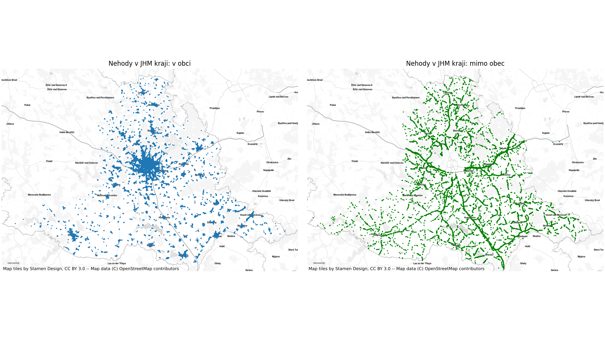
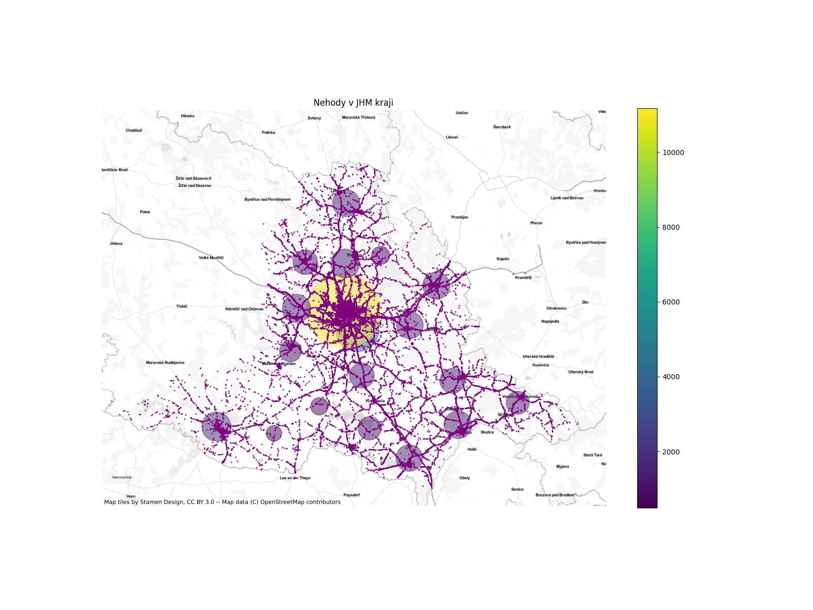

# Datalynator

This repo contains a set of Python scripts designed to download, process, analyze, and visualize traffic accident data from the Czech Republic. The data comes in CSV format, and these scripts help you easily extract insights and generate visualizations.

For example, the images:

- **geo1.png** — Displays accidents in the South Moravian Region broken down by **municipality** (obec) and **outside municipality** (mimo obec) areas.

  

- **geo2.png** — Visualizes clusters of accidents in the same region, highlighting accident hotspots.

  

